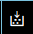

### Инструкция по установке и настройке библиотеки boost на linux
#### В терминале:
**Debian/Ubuntu**
	sudo apt-get install libboost-all-dev
	
**Fedora/CentOS/RHEL**
==в живую не проверял, используйте на свой страх и риск== 
	sudo dnf install boost-devel

#### В CMake файле
**Для QT**
можете скопировать это себе. 
==Следите за перечислением классов в add_executable(...)==

CMakeLists.txt
``` CMake
cmake_minimum_required(VERSION 3.28)
project(prosoft_distributed_storage_system)

set(CMAKE_CXX_STANDARD 17)

find_package(Boost REQUIRED COMPONENTS system filesystem)

include_directories(${BOOST_INCLUDE_DIRS})

# QT собирает этот список автоматически, в VScode мне пришлось писать сюда руками
add_executable(prosoft_distributed_storage_system main.cpp
    src/Storage/storageclient.h src/Storage/storageclient.cpp
    src/Storage/filesplitter.h src/Storage/filesplitter.cpp)

target_link_libraries(prosoft_distributed_storage_system ${Boost_LIBRARIES})
```

**Для VScode**
- У вас должен быть CMakeLists.txt.
- В палитре команд (Ctrl+Shift+P) введите "CMake: Select a kit". Выберите подходящий компилятор. Например GCC.
- Нажмите кнопку  в модуле cmake, либо в верхней панели  у вас появится директория ./buld
- Выполните следующие команды в терминале (Ctrl+ё):
```
cd build      # Переходим в директорию сборки
cmake ..      # Запускаем CMake для конфигурации проекта
make          # Компилируем проект
./MyProject   # Запускаем исполняемый файл (предполагается, что имя исполняемого файла MyProject)
```


**Более сложный путь в CMake**
CMakeLists.txt
```CMake
cmake_minimum_required(VERSION 3.28)
project(prosoft_distributed_storage_system)

set(CMAKE_CXX_STANDARD 17)

# Укажите путь к установке Boost (замените на фактический путь) 
# У меня он как здесь
set(Boost_ROOT /usr/include/boost)

find_package(Boost REQUIRED COMPONENTS system filesystem PATHS ${Boost_ROOT}/stage)

include_directories(${BOOST_INCLUDE_DIRS})

# QT собирает этот список автоматически, в VScode мне пришлось писать сюда руками
add_executable(prosoft_distributed_storage_system main.cpp
    src/Storage/storageclient.h src/Storage/storageclient.cpp
    src/Storage/filesplitter.h src/Storage/filesplitter.cpp)

target_link_libraries(prosoft_distributed_storage_system ${Boost_LIBRARIES})
```
#### Пример main.cpp для проверки
```cpp
#include <iostream>
#include <boost/filesystem.hpp>

int main() {

namespace fs = boost::filesystem;
fs::path p("test.txt"); // Или любой другой существующий файл

try {
std::cout << "File size: " << fs::file_size(p) << std::endl;
} catch (const fs::filesystem_error& ex) {
std::cerr << "Error: " << ex.what() << std::endl;
}

return 0;
}
```
