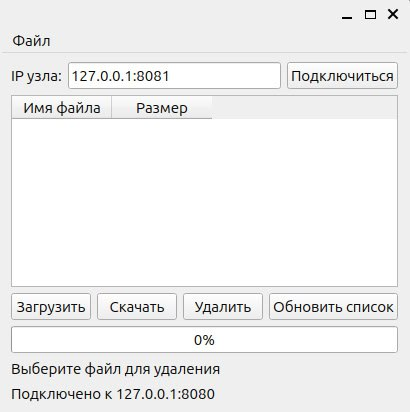

Требования оформлены на основе стандарта [IEEE STD 830-1998](https://github.com/maxvipon/IEEE-Std-830-1998-RU/blob/master/IEEE%20STD%20830-1998%20(RU).md?ysclid=m9udka8suu220017623) 

### 1. Введение  

#### 1.1. Назначение
В данном файле описываются технические требования к распределенной файловой системе ProSoft Distributed Storage System (PSDSS).
Данный файл предназначен для разработчиков PSDSS.
#### 1.2. Область применения
Целью разработки является продукт ProSoft Distributed Storage System (PSDSS). PSDSS представляет из себя распределенную файловую систему.
Основной задачей PSDSS является, хранение и управление файлами в облачной среде. PSDSS предоставляет возможности для:
- Хранения больших объемов данных в облаке.
- Обмена файлами между узлами и пользователем.
- Обеспечения резервного копирования и восстановления данных.
#### 1.3. Определения, акронимы и сокращения
- **Клиент -** программа на устройстве пользователя, которая осуществляет запросы к серверной части системы
- **Облако -** серверная часть системы.
- **Узел -** ключевая составляющая серверной инфраструктуры, представляющая собой программно-аппаратный комплекс, который обрабатывает запросы клиентской части системы.
- **Распределенная файловая система -** это система, в которой ни один узел не выполняет центральную функцию или хранит все данные. Вместо этого ресурсы и обязанности распределяются между множеством узлов (серверов), что повышает надежность, безопасность и снижает риск централизации данных.

1. Введение  
	- 1. Назначение
	- 2. Область действия
	- 3. Определения, акронимы и сокращения
  
2. Общее описание  
	- 1. Взаимодействие продукта
	- 2. Функции продукта
	- 3. Характеристики пользователя
	- 4. Ограничения
  
3. Специфические требования  
	- 1. Требования к внешним интерфейсам  
	    - 1. Интерфейсы пользователя
	    - 2. Интерфейсы аппаратного обеспечения
	    - 3. Интерфейсы взаимодействия
	- 2. Функциональные требования
### 2. Общее описание  

#### 2.1. Взаимодействие продукта (с другими продуктами и компонентами)
PSDSS является самодостаточной системой для работы которой необходимы ОС:
- Linux для работы узлов
- Windows 10, 11 или Linux для работы клиента.

#### 2.2. Функции продукта
Система делится на клиентскую и серверную части.
**Клиентская часть** обеспечивает взаимодействие с файлами находящимися в облаке. А именно:
- получение списка файлов
- загрузка файлов в облако
- скачивание файлов из облака
- удаление файлов в облаке

**Серверная часть** представляет из себя набор узлов, которые обеспечивают:
- обработку запросов клиентской части
- хранение и резервирование файлов
#### 2.3. Характеристики пользователя
Любой кто имеет опыт работы с ПК и так же имеет соответствующую группу по электробезопасности.
#### 2.4. Ограничения

##### 2.4.1. Аппаратные ограничения
Система должна поддерживать скорость загрузки файлов из облака, сопоставимую с пропускной способностью сети.
Возможен долгий отклик системы, на действие пользователя при большом количестве узлов в сети.
==*По любому есть еще ограничения*==
##### 2.4.2. Параллельные операции
При одновременной работе клиента и узлов обмен данными осуществляется по протоколу HTTP/TCP. Такое взаимодействие определяет постоянную работу и опрос всех участников сети.
##### 2.4.3. Требования к надежности
Система должна обеспечивать: 
- возможность автоматического восстановления любого файла, находящегося в облаке, при исключении из сети любого узла.
- Корректное отображение файла, после его загрузки и скачивания из облака.  
##### 2.4.4. Правовые вопросы
На данном этапе разработчики не ставят цель монетизировать PSDSS, поэтому вопросы применения лицензированных ПО, стандартов и протоколов, не являются приоритетными при разработке.

  
### 3. Специфические требования
#### 3.1. Требования к внешним интерфейсам  
##### 3.1.1. Интерфейсы пользователя GUI
Интерфейс пользователя представлен окном, в котором есть такие элементы как:
1. Поле ввода IP адреса узла.
2. Прокручиваемый список файлов, которые находятся в облаке.
3. Список узлов с IP адресами и состоянием узлов.
4. Кнопки:
	- "Загрузить" - загрузить файл в облако
	- "Скачать" - скачать файл из облака
	- "Удалить" - удалить файл находящийся в облаке
5. Строка прогресса скачивания или загрузки файла
6. Поле вывода с именем файла на облаке или пути к файлу
7. Поле вывода системных сообщений

На рис.1 показано условное изображение окна клиента.

Рис.1. Общий вид главного окна приложения
##### 3.1.2. Интерфейсы аппаратного обеспечения
Ethernet порты, WI-FI адаптеры.
##### 3.1.3. Интерфейсы взаимодействия
Команды взаимодействия с узлами: 
1. Получить список узлов
2. Получить список файлов
3. Передать файл с именем *fileName* в хранилище с именем *storageName*

Статусные команды:  
1. Система в процессе переконфигурирования  
2. Система в состоянии ok
#### 3.2. Функциональные возможности системы
##### 3.2.1. Функция подключения к узлу
С данной функции начинается работа клиента с сетью узлов.
**Исходные данные:** IP адрес из поля ввода IP адреса узла.
**Результат удачного сценария:** 
- подключение к узлу.
- получение списка файлов, находящихся в облаке.
- получение списка узлов.

**Результат неудачного сценария:** 
- сообщение о неудачной попытке подключения в поле вывода системных сообщений
##### 3.2.2. Функция загрузки файла в облако
Данная функция позволяет загружать новые файлы в облако.
**Исходные данные:** в поле 6 указан путь к файлу, пользователя, нажата кнопка "загрузить", сеть находится в консистентном состоянии.
**Результат удачного сценария:** 
1. Копия файла делится на фрагменты заранее определенного размера
2. создается сопровождающий файл, содержащий имя исходного файла,количество его фрагментов и хэш сумму файла
3. Фрагменты сортируются и отправляются на узлы
