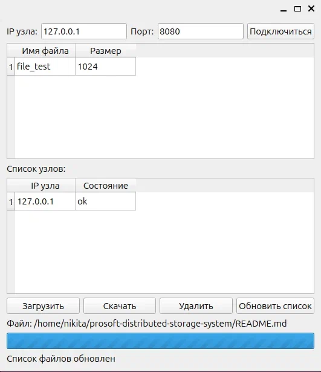

Требования оформлены на основе стандарта [IEEE STD 830-1998](https://github.com/maxvipon/IEEE-Std-830-1998-RU/blob/master/IEEE%20STD%20830-1998%20(RU).md?ysclid=m9udka8suu220017623) 

### 1. Введение 

#### 1.1. Назначение 

В данном файле описывается спецификация требований к распределенной файловой системе 
ProSoft Distributed Storage System (PSDSS). Данный файл предназначен для команды, 
которая будет реализовывать PSDSS и проверять корректность работы приложения.

#### 1.2. Область применения 

Целью разработки является создание продукта ProSoft Distributed Storage System (PSDSS). 
Продукт PSDSS является распределенной файловой системой. Основной задачей PSDSS является 
хранение и управление файлами в облачной среде. Продукт PSDSS предоставляет возможности для:
- Хранения больших объемов данных в облаке.
- Обмена файлами между узлами и пользователем.
- Обеспечения резервного копирования и восстановления данных.

#### 1.3. Определения, акронимы и сокращения 

- **Клиент -** программа на устройстве пользователя, которая осуществляет запросы к серверной
части системы.
- **Облако -** серверная часть системы.
- **Узел -** ключевая составляющая серверной инфраструктуры, представляющая собой
программно-аппаратный комплекс, который обрабатывает запросы клиентской части системы.
- **Распределенная файловая система -** это система, в которой ни один узел не выполняет
центральную функцию или хранит все данные. Вместо этого ресурсы и обязанности распределяются
между множеством узлов (серверов), что повышает надежность, безопасность и снижает риск
централизации данных.

#### 1.4. Обзор 

1. [Введение](#introduction)  
	1.1. [Назначение](#assignment)  
	1.2. [Область применения](#field)  
	1.3. [Определения, акронимы и сокращения](#acronyms)  
	1.4. [Обзор](#review)  
  
2. [Общее описание](#description)  
	2.1. [Архитектура системы](#architecture)  
	2.2. [Функции продукта](#functions)  
	2.3. [Характеристики пользователя](#user-charachteristic)  
	2.4. [Ограничения](#limitations)  
	
3. [Функциональные требования](#functional-requirements)  
	3.1. [Клиентская часть](#client)  
	3.2. [Серверная часть](#server)  
	
4. [Специфические требования](#specific-requirements)  
	4.1. [Пользовательские требования](#user-requirements)  
	4.2. [Требования к пользовательскому интерфейсу (GUI)](#gui)  
	4.3. [Требования к взаимодействию администратора с узлам ](#admin_ui)  
	4.4. [Требования к интерфейсам взаимодействия компонентов системы](#interaction)  
	4.5. [Требования к тестированию](#testing)  
	
5. [Заключение](#conclusion)

### 2. Общее описание 

#### 2.1. Архитектура системы 

Система делится на клиентскую и серверную части.
**Клиент** запускается на устройстве пользователя, которое имеет доступ к сети, в которой 
находится серверная часть.
**Серверная часть** представляет из себя кластер из 1 или более равноправных узлов, 
которые находятся в одной сети.
Узлы обмениваются данными между собой по протоколу HTTP/TCP и собирают данные о других узлах в сети.

#### 2.2. Функции продукта 

Система делится на клиентскую и серверную части.  
**Клиентская часть** обеспечивает взаимодействие с файлами находящимися в облаке. А именно:
- получение списка файлов;
- загрузка файлов в облако;
- скачивание файлов из облака;
- удаление файлов в облаке.

**Серверная часть** представляет из себя набор узлов, которые обеспечивают:
- обработку запросов клиентской части;
- взаимодействие между узлами;
- хранение и резервирование файлов.
  
#### 2.3. Характеристики пользователей 

Разграничение прав пользователей в настоящей версии приложения не предусмотрено.

#### 2.4. Ограничения 

##### 2.4.1. Аппаратные ограничения 

**Клиентская часть**
1. ОС Linux.
2. ОЗУ не менее 2 ГБ.
3. ПЗУ не менее 5 ГБ.
4. Ethernet или Wi-Fi адаптер.

**Серверная часть** должна состоять не менее чем из 1 узла.
Требования для 1 узла:
1. ОС Linux.
2. ОЗУ не менее 2 ГБ.
3. ПЗУ не менее 5 ГБ.
4. Ethernet или Wi-Fi адаптер.

##### 2.4.2. Параллельные операции

При одновременной работе клиента и узлов обмен данными осуществляется по протоколу HTTP. 
Такое взаимодействие определяет постоянную работу и опрос всех участников сети.
Время ожидания ответа от любого из узлов, не должно превышать 30 секунд.

##### 2.4.3. Требования к надежности

Система должна обеспечивать: 
- хранение файлов, фрагменты которых есть не менее чем на двух узлах сети;
- возможность автоматического восстановления любого файла, хранящегося в облаке,
при исключении из сети любого узла;
- корректное отображение файла, после его загрузки и скачивания из облака.

### 3. Функциональные требования  

Система должна обладать следующими функциями

#### 3.1 Клиентская часть 

1. Отображение списка файлов хранящихся в облаке.
2. Получение списка IP адресов узлов.
3. Скачивание фрагментов файла из облака и восстановление целостности файла.
4. Разделение файла на фрагменты установленного размера 
5. Отправка фрагментов на узлы с обеспечением резервируемости каждого из фрагментов.
6. Удаление файлов находящихся в облаке.
7. Расчёт хеш сумм для файла и фрагментов файла при загрузке и скачивании.
8. Создание сопровождающих файлов, содержащих:
    - имя файла
    - дату и время загрузки файла
    - количество фрагментов файла 
    - хэш суммы
9. Проверка хэш сумм при скачивании файла.

#### 3.2 Серверная часть 

Каждый узел должен обладать следующими функциями:
1. Опрос других узлов находящихся в сети.
2. Рассылка собственного идентификатора и IP адреса другим узлам сети.
3. Обработка запросов клиентской части.
4. Пересылка по запросу фрагментов файла, другим узлам.
5. Запрос фрагментов файла из других узлов.
6. Контроль, наличия фрагментов файла, которые находятся в узле, в хотя бы ещё одном из узлов.
7. Согласование списка файлов с другими узлами.
8. Запуск процедуры обмена фрагментами файлов с другими узлами, при изменении количества узлов.
9. Отправка информации о состоянии сети узлов в клиентскую часть.
    
### 4. Специфические требования 

#### 4.1. Пользовательские требования 

1. Получение информации о файлах, которые находятся в облаке.
2. Загрузка новых файлов в облако. 
3. Скачивание файлов из облака.
4. Удаление файлов, которые находятся в облаке.
   
#### 4.2. Требования к пользовательскому интерфейсу (GUI) 

Пользовательский интерфейс, должен содержать кнопки, поля ввода, поля вывода, обеспечивающие 
следующие функции:
1. Подключение к узлу при вводе его IP адреса.
2. Отображение файлов находящихся в облаке.
3. Выбор файлов находящихся в облаке.
4. Выбор файлов находящихся на устройстве пользователя.
5. Кнопки:
    - "Подключиться" - отправляет запрос на подключение к узлу
    - "Отключиться" - разрывает соединение с узлами
    - "Загрузить" - выполняет загрузку файла в облако
    - "Удалить" - удаляет файл находящийся в облаке 
    - "Скачать" - скачивает файл из облака
6. Отображение информация об узлах.
7. Отображение информации о состоянии загрузки или скачивании файла.

На Рис. 1 показано условное изображение окна клиента.  

  
Рис. 1. Общий вид главного окна приложения

#### 4.3. Требования к взаимодействию администратора с узлам 
После запуска серверной части приложения на устройстве, с программой можно взаимодействовать 
из консоли следующим образом:
**./psdss_server [команда]**  

Перечень команд:
1. **start**
2. **stop**
3. **status**  
4. **clear**
5. **put** \[file1 file2 ...]
6. **remove** \[file1 file2 ...]

**start**
- Запускает сервер на данном компьютере.  

Техническая реализация:  
Отправляет рассылку на все машины в локальной сети, в ответ на которую ожидает получить статус 
других компьютеров, на которых запущен сервер. Если получает в ответ пакет со статусом с работающего 
сервера. Начинает процесс подключения к кластеру, после которого сервера становятся связаными. 

**stop**
- Останавливает сервер на данном компьютере.  

Примечание:  
Остальная файловая система начинает реконфигурацию. (возможно не сразу, а по истечению времени, 
или в случае получения команды от пользователя)

Техническая реализация:  
Процесс работы сервера прерывается. (Возможно отправляет другим узлам сообщение о остановке)

**status**
- Выводит состояние сервера в консоль

**clear_all**
- Очищает всю файловую систему кластера

Техническая реализация:  
Посылает узлам сообщение с командой очистки. Чистит локальное хранилище.

**put \[file1 file2 ...]**
- Помещает перечисленные файлы в файловую систему кластера

**remove \[file1 file2 ...]**
- Удаляет перечисленные файлы из файловой системы кластера
#### 4.4. Требования к интерфейсам взаимодействия компонентов системы 

##### 4.3.1. Аппаратные

Адаптеры Ethernet или WI-FI.

##### 4.3.2. Программные

Клиент и узлы должны иметь возможность чтения, записи и отправки файлов в формате Json.

#### 4.5. Требования к тестированию и приемке 

##### 4.4.1. Исходные данные

Объект тестирования:
1. Все основные функциональные модули приложения.
2. Нефункциональные характеристики: 
	- производительность
	- безопасность
	- удобство использования

##### 4.4.2. Критерии приемки

1. Функционал считается принятым, если все предусмотренные в ТЗ функции работают корректно
и без критических ошибок.
2. Все баги с приоритетом «критический» и «высокий» устранены.
3. Прохождение всех тест-кейсов, описанных в тестовой документации.
   
##### 4.4.3. Типы тестирования

1. Функциональное тестирование (проверка соответствия требованиям).
2. Нагрузочное тестирование (проверка работы при максимальной нагрузке).
3. Юзабилити-тестирование (оценка удобства интерфейса).
   
##### 4.4.4. Тестовая документация

1. Разработка тест-плана, включающего цели, объекты и методы тестирования.
2. Создание тест-кейсов с описанием шагов, ожидаемых результатов и критериев успешности.
3. Ведение отчётов о выполнении тестов и найденных дефектах.
   
##### 4.4.5. Среда и инструменты тестирования

1. Использование тестового стенда, максимально приближенного к боевому окружению.
2. Подготовка тестовых данных, необходимых для проверки всех сценариев.
   
### 5. Заключение 

Настоящий документ определяет полный перечень технических требований к облачному хранилищу, 
включая функциональные, архитектурные и нефункциональные аспекты системы. Основная цель — 
обеспечить масштабируемое и доступное решение для хранения, управления и обмена данными 
в распределенной среде.

На основании утвержденных требований будет:
- Разработана детальная архитектура системы.
- Сформированы планы тестирования.

Документ служит основой для разработки, приемки и эксплуатации облачного хранилища. 
Конечный продукт должен соответствовать всем описанным требованиям.
